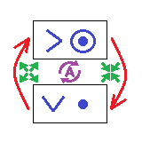
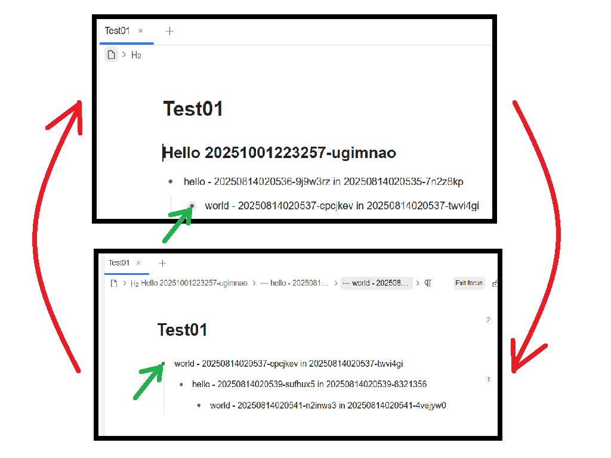

[中文](https://github.com/abc202306/siyuan-adaptive-expander/blob/main/README_zh_CN.md)

# SiYuan Adaptive Expander

SiYuan Plugin: Automatically expands collapsible blocks such as list blocks or section blocks when those blocks are focused on or previewed via links.

The adaptive expansion behavior of this plugin is similar to that found in note-taking software like Logseq and Workflowy. However, its functionality is not limited to list blocks—it also applies to section blocks, table blocks, code blocks, and other types of collapsible blocks.

## How to Use

- Enable the plugin to Enable the function：Automatically expands collapsible blocks such as list blocks or section blocks when those blocks are focused on or previewed via links.
- Disable the plugin to Disable the function：Automatically expands collapsible blocks such as list blocks or section blocks when those blocks are focused on or previewed via links.
