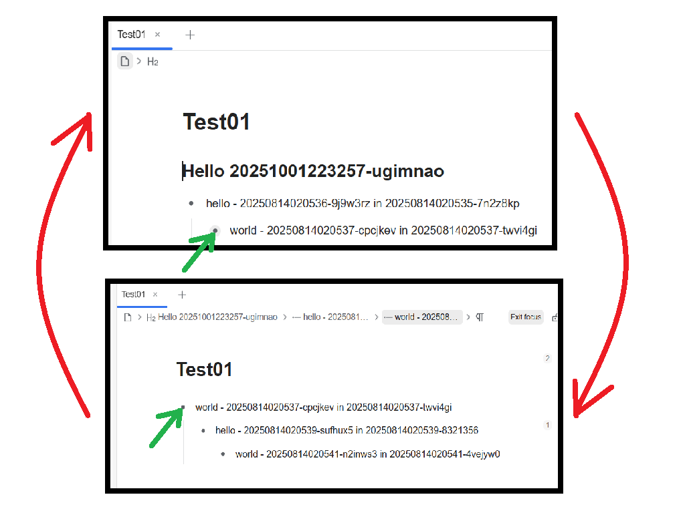

[English](https://github.com/abc202306/siyuan-adaptive-expander/blob/main/README.md)

# 思源自适应展开器

思源插件：自适应展开列表块或章节块等可折叠块，当对可折叠块进行聚焦和链接预览时

该插件的自适应展开的效果与笔记软件 Logseq 和 Workflowy 类似，但其作用的效果不仅适用于列表块，而且也适用于章节块、表格块和代码块等类型的块

## 如何使用

- 启用插件以启用功能：自适应展开列表块或章节块等可折叠块，当对可折叠块进行聚焦和链接预览时
- 禁用插件以禁用功能：自适应展开列表块或章节块等可折叠块，当对可折叠块进行聚焦和链接预览时
