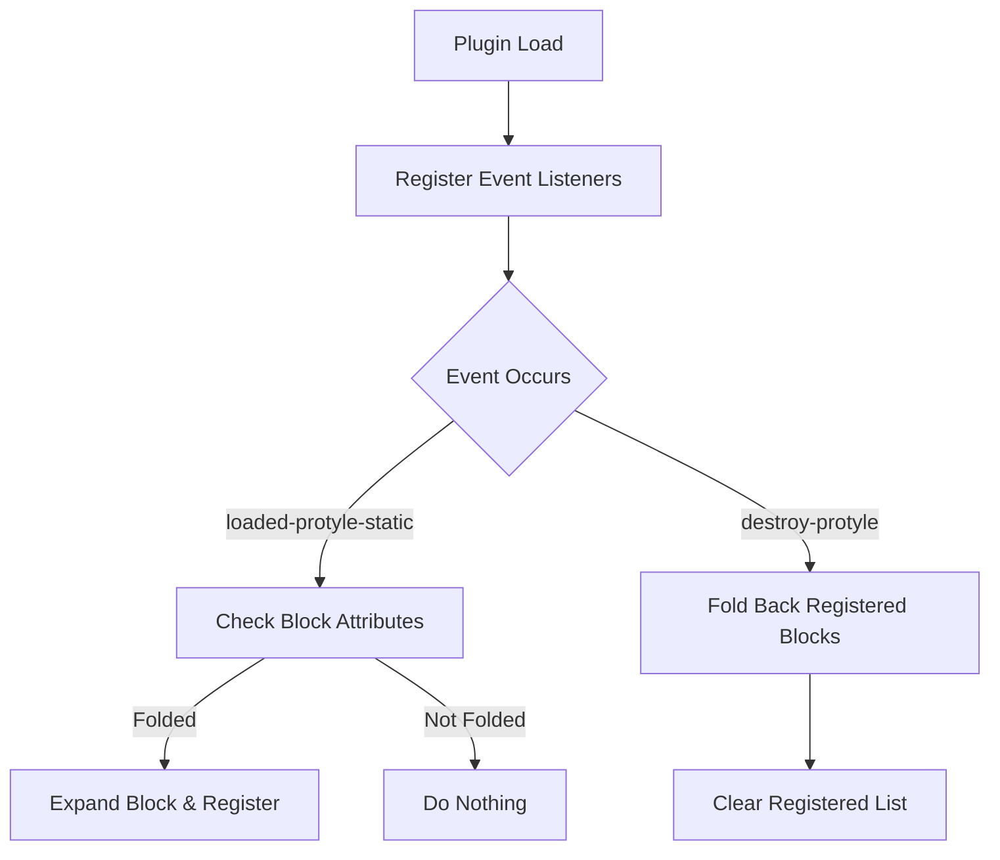
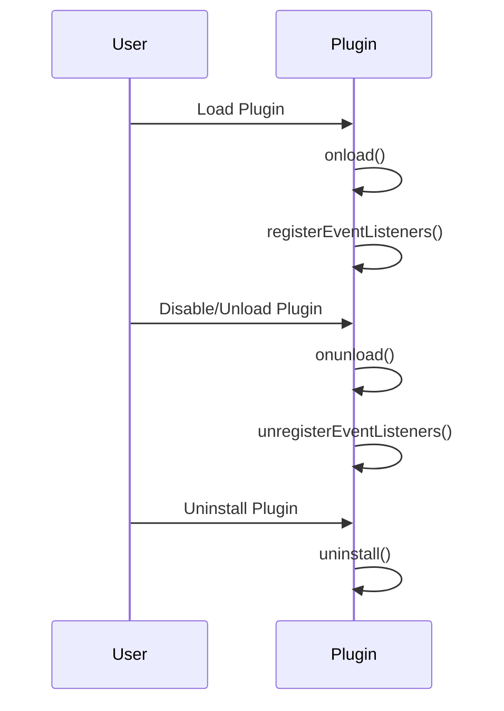
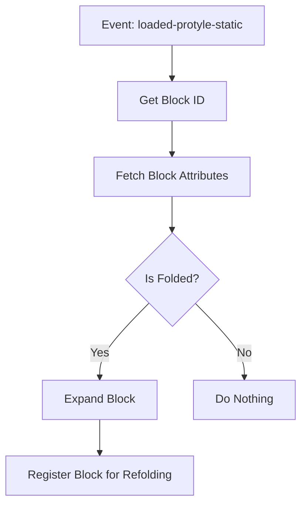
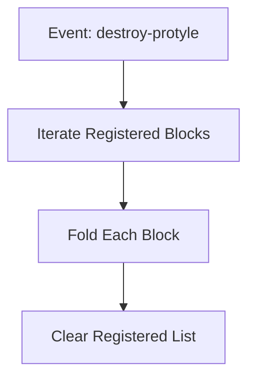
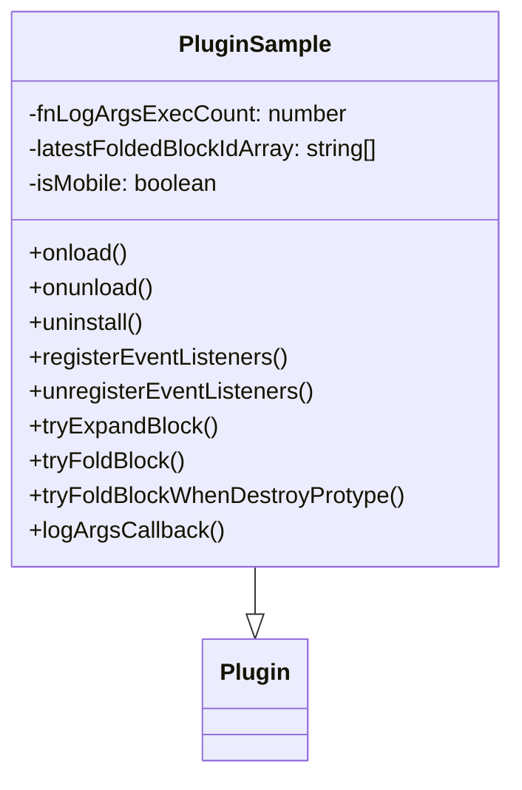

# Prompt

Generate a documentation full of graphs, making the script #file:index.ts more intuitive and easy to understand

# Answer

Here is a documentation draft for your index.ts script, featuring intuitive diagrams and explanations to make the plugin's logic and flow easy to understand.

---

# Siyuan Adaptive Expander Plugin Documentation

## Overview

This plugin automatically expands or folds blocks in Siyuan based on their content when a page is loaded. It listens to specific events, checks block attributes, and manages their expanded/collapsed state for a smoother user experience.

---

## High-Level Architecture

---

## Event Flow

### 1. Plugin Lifecycle

---

### 2. Block Expansion Logic

---

### 3. Block Refolding Logic

---

## Key Data Structures

- **latestFoldedBlockIdArray**:  
  An array storing IDs of blocks that were expanded and need to be folded back later.

---

## Main Methods

### registerEventListeners / unregisterEventListeners

- Registers/unregisters event handlers for:
  - `loaded-protyle-static` (expand/fold logic)
  - `destroy-protyle` (refold logic)

### tryExpandBlock

- Checks if a block is folded.
- If so, expands it and adds its ID to `latestFoldedBlockIdArray`.

### tryFoldBlockWhenDestroyProtype

- Folds back all blocks in `latestFoldedBlockIdArray` when the protyle instance is destroyed.

---

## Debugging

- Set `myDebug = true` to enable detailed logging.
- Use `window.myPathVar` to specify which part of the event object to log.

---

## Class Diagram

---

## Summary

- **Purpose**: Automatically expand/fold blocks for better readability.
- **How**: Listens to events, checks block attributes, manages expanded/collapsed state.
- **Customization**: Debugging and logging are configurable.

---

Let me know if you want this as a Markdown file in your project, or need more diagrams or details!